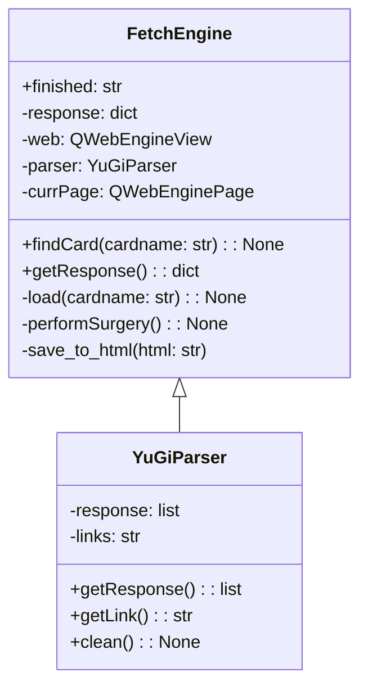

# YuGiDex-WebScraper

The latest and greatest API for retrieving Yu-Gi-Oh card prices.

TCGPlayer is currently not handing out API keys. Therefore any incoming programmers wanting this information would be out of luck.

**However** I have made an API that allows you to obtain the latest card prices using PyQt's QWebEngine Module.

*Note:* This is not mean't to be a mass retrieval tool. The API is built ontop of a Chromium engine that scrapes the generated HTML data after the site has loaded. The speed of retrieving data would 100% be dependent on your internet speed. This also means trying to get prices for loads of card prices would result in SUPER slow speeds because the engine is reloading the page for each entry.

All the disclaimers aside, here is the API:



### Setup
---

*Optional but recommended:* Make a python virtual environment and activate it.

Run the following command in the terminal (in project folder directory):

```cmd
pip install -r requirements.txt
```

This would install all the dependencies the API would require in order to run.

### Usage
---

Since this API is built with PySide6 framework, the API is an "invisible" widget.

In order to run it, you would need to instantiate it inside another QWidget object.

Use the findCard method to search for the card prices you want to retrieve.

Finally use the finished signal to determine when the prices have been successfully retrieved.

```python
    self.test = FetchEngine()
    self.test.findCard("Dark Magician")
    self.test.finished.connect(self.slotfunc)
```

The connect emitter would run a function that is passed (in our example; self.slotfunc).

Finally, write the callback function that would call the getResponse method from the FetchEngine instance.

```python
    def slotfunc(self):
        
        self.response = self.test.getResponse()
```

*Note:* You must use the finished signal and connect emitter to retrieve the information. This is caused by the loading time of the webpage. If you try to retrieve the response directly after calling findCard, the page might have not loaded yet, resulting in an empty dictionary. The finished signal ensures that the response is retrieved AFTER the prices have been obtained.